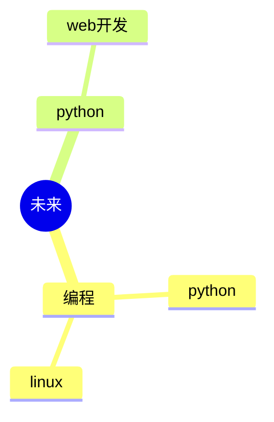

  
  <!-- dynamic typing effect 动态打字效果 -->
  

    
  

<!-- Snake Code Contribution Map 贪吃蛇代码贡献图 -->
<picture>
  <source media="(prefers-color-scheme: dark)" srcset="https://cdn.jsdelivr.net/gh/sun0225SUN/sun0225SUN/profile-snake-contrib/github-contribution-grid-snake-dark.svg" />
  <source media="(prefers-color-scheme: light)" srcset="https://cdn.jsdelivr.net/gh/sun0225SUN/sun0225SUN/profile-snake-contrib/github-contribution-grid-snake.svg" />
  
</picture>

#  🙋 Hello

<table>
<tr><td>

<!-- About me 关于我 -->
### 🤺 About Me

&emsp;&emsp;天道运而无所积，故万物生!

&emsp;&emsp;第一次加入开源大家庭，请多指教

&emsp;&emsp;让世界更美好坚持就一定成功

<strong>&emsp;&emsp;To make the world a better place, we must persist and succeed</strong>

</td></tr>

<tr><td>

<!-- 近期博客 -->
### 📃 Recent Blog

<!-- START_SECTION:blog -->
* <a href='https://blog.sunguoqi.com/archives/ohmyposh' target='_blank'>Oh My Posh | Windows Terminal 美化指南</a> - 2023-07-15
* <a href='https://blog.sunguoqi.com/archives/brain' target='_blank'>小孙同学 の 第二大脑正在施工中 。。。</a> - 2023-03-26
* <a href='https://blog.sunguoqi.com/archives/20230225' target='_blank'>奔跑在自己的时区里，你好哇，我的22岁！</a> - 2023-02-25
* <a href='https://blog.sunguoqi.com/archives/github_profile_0' target='_blank'>让面试官眼前一亮，手把手带你打造个性化的 GitHub 首页</a> - 2023-01-30
* <a href='https://blog.sunguoqi.com/archives/chatgpt' target='_blank'>快速上手，教你如何将 ChatGPT 接入到微信公众号</a> - 2023-01-29
<!-- END_SECTION:blog -->

</td></tr>

</table>

<!-- ########################################## 分割 ########################################## -->

<!--  skill badge 技能徽章 -->
💪 正在学习

  
🧠 计划学习

<!-- just img 图片 -->

<tr><td>

### 特别鸣谢（Special thanks）
https://github.com/sun0225SUN
</td></tr>
